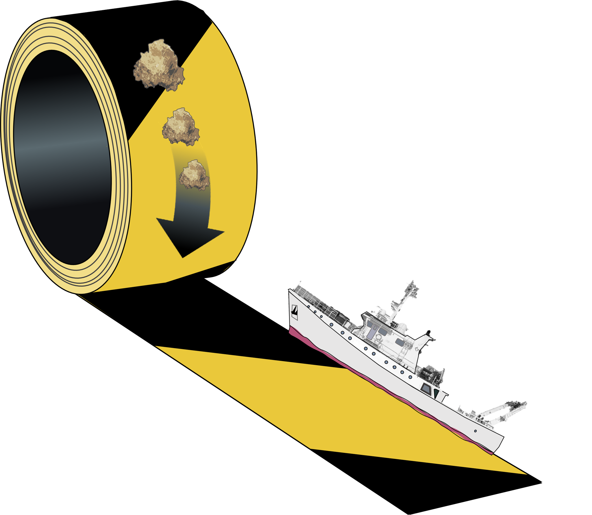

# RUBALIZ
<div align="center">
  
</div>

<br/>

<div align="center">
  <!-- Python version -->
  <a href="https://pypi.python.org/pypi/rubaliz">
    
  </a>
  <!-- PyPi -->
  <a href="https://pypi.python.org/pypi/rubaliz">
    
  </a>
  <!-- Zenodo -->
  <a href="https://doi.org/10.5281/zenodo.6425451">
    
  </a>
  <!-- License -->
  <a href="https://opensource.org/licenses/MIT">
    
  </a>
</div>

<br/>

RUBALIZ stands for RUpture-Based detection method for the Active mesopeLagIc Zone.
It determines the active mesopelagic zone boundaries from CTD casts, using five variables:
- Fluorescence
- [0<sub>2</sub>]
- Potential temperature
- Salinity
- Density

RUBALIZ was introduced in Fuchs, Baumas et al. (2022).

## Installation
The package can be installed using pip
```python
pip install rubaliz
```

or alternatively using conda:
```python
conda install rubaliz
```

## Getting started
The metadata have to be filled in a dictionary as shown below:

```python
from rubaliz import rubaliz

# Define CTD files info
info_dict = {'cruise_name': 'DY032',
'station_name': 'PAP',
'ub_range': [280, 320],
'lb_range': [1000, 1300],
'pres_col': 'PRES',
'Fluorescence': 'flC',
'Oxygen': 'oxygen',
'Pot. temp.': 'potemperature',
'Salinity': 'PSAL',   
'Density': 'sigma-\ufffd00',
'files_format': '.cnv',
'sep': None,
'data_folder': '<your_path_to_data>'}
```

The cruise and station names are optional.
The maximum depth ranges to look for the upper bound and lower boundaries of the active mesopelagic zone, ub_range and lb_range, are set to [280, 320] and [1000, 1300] by default, respectively.
The pres_col is the name of the column containing the pressure data in the CTD cast.
Similarly, the Fluorescence, Oxygen, Pot. temp., Salinity and Density stand for the column names of the fluorescence, oxygen, potential temperature, salinity data, and density, respectively.
If one of these five signals is missing, please set it to None.
RUBALIZ can handle '.cnv', '.txt' and '.csv' files. For '.csv' and '.txt' files a separator (sep) has to be set.
The data_folder contains all the CTD casts for a given (cruise, station). An example of such a cast is given in the data folder.

The model can be run in the following way:
```python
# Perform the rupture detection
ruba = rubaliz(info_dict)
ruba.fit()

# Access to the estimations
ruba.boundaries
ruba.nb_ctd_ub
ruba.nb_ctd_lb
```
